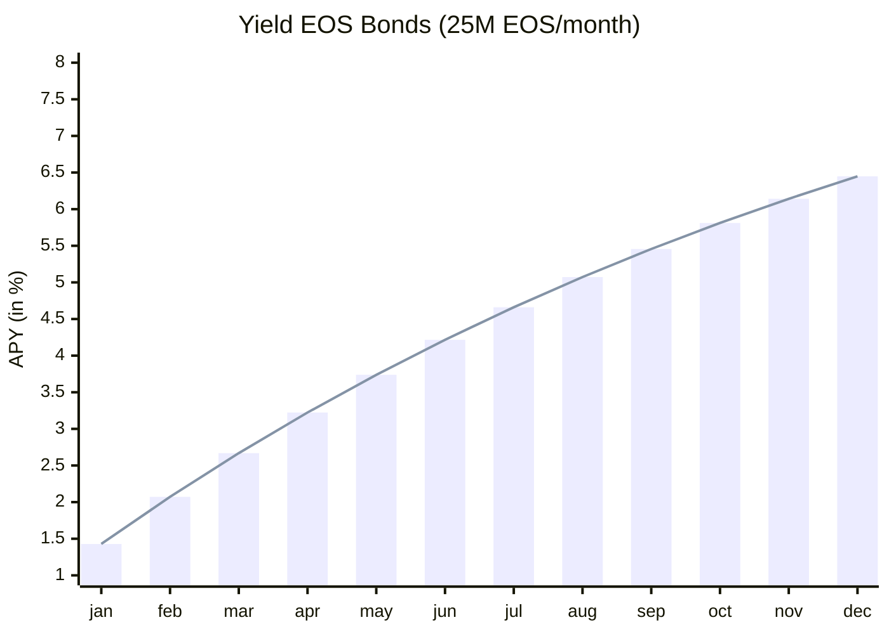

# EOS Bonds (T-Bills)

> EOS Bonds are a financial instrument that allows you to stake `$EOS` long term to the network in exchange for a fixed interest rate. The bonds are issued by the EOS network and are backed by the full faith and credit of the network. The bonds are sold at a discount to their face value and pay interest at maturity.

| Minimum denomination | Sold at | Maturity | Interest payments |
|----------------------|---------|----------|--------------------|
1 bond (1,000 EOS face value) | Discount | 4-, 8- , 13-, 17-, 26-, and 52-week | Interest and principal paid at maturity

## How it works

1. **Purchase**: You purchase a bond at a discount to its face value. The bond is denominated in EOS and has a face value of 1,000 EOS.

2. **Stake**: You stake the bond to the network. The bond is locked up for a fixed period of time and you earn interest on the bond.

3. **Interest**: The bond pays interest at maturity. The interest is paid in EOS and is calculated based on the face value of the bond.

4. **Maturity**: The bond matures at the end of the fixed period. You receive the face value of the bond plus the interest earned.

## Benefits

- **Fixed interest rate**: The bond pays a fixed interest rate at maturity. This provides certainty on the return on your investment.

- **Low risk**: The bonds are issued by the EOS network and are backed by the full faith and credit of the network. This makes them a low-risk investment.

- **Liquidity**: The bonds are transferable and can be sold on the secondary market. This provides liquidity to the bondholder.

- **Diversification**: The bonds provide a way to diversify your investment portfolio and earn a fixed return.

## Risks

- **Interest rate risk**: The interest rate on the bond is fixed at the time of purchase. If interest rates rise, the bond may be less attractive to investors.

- **Smart contract risk**: The bonds are issued on the EOS network and are subject to smart contract risk. If there is a bug in the smart contract, it may result in a loss of funds.

- **Liquidity risk**: The bonds are transferable, but there may not be a liquid secondary market for the bonds. This may result in difficulty selling the bonds at a fair price.

## Sliding Discount Rate Formula

This protocol calculates the discount rate and price of purchasing EOS bonds based on total deposits and the number of bonds purchased. The discount rate dynamically adjusts to ensure that deposits are not depleted.

### Parameters

- **Total Deposits (𝐷)**: The cumulative amount of funds deposited into the protocol. This amount is adjusted whenever bonds are purchased, with the purchase price being subtracted from the total deposits.
- **Fixed Number of Bonds (𝑁)**: The fixed number of bonds used for calculating the discount rate. In this protocol, 𝑁 is set to 10,000.
- **Number of Bonds Purchased (k)**: The number of bonds currently being purchased.
- **Discount Rate ($𝑟$)**: The discount rate applied to the bonds.

$$ 𝑟 = \frac{𝐷}{(𝑁+k) ⋅ 𝑁 } $$

### Price of Each Bill

The price of each bill 𝑃 is calculated by subtracting the discount rate from 1:

$$ P = 1 - 𝑟 $$

### Price Calculation for Multiple Bills

To calculate the total price of buying multiple bills, we use the following formula:

$$ 𝑃_{total} = k ⋅ P = k ⋅ (1− \frac{𝐷}{(𝑁+k) ⋅ 𝑁 }) $$

## References

- https://www.fidelity.com/fixed-income-bonds/individual-bonds/us-treasury-bonds
- https://www.investopedia.com/terms/t/treasurybill.asp